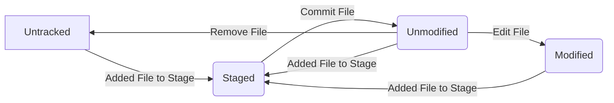

# Git Explanation\'s Purpose
[Table of Contents](#Table-of-Contents)

The purpose of this project and repository is to help explain what the tool Git is.
I will be using this project as a personal Git reference-guide. 

# Table of Contents
* [Git Explanation\'s Purpose](#Git-Explanations-Purpose)
* [Table of Contents](#Table-of-Content)
* [Git Introduction](#Git-Introduction)
* [Notes on the Book \"Pro Git\"](#Notes-on-the-Book-Pro-Git)
  * [1. Getting Started](#1-Getting-Started)
    * [1.1 About Version Control](#11-Getting-Started---About-Version-Control)
    * [1.2 A Short History of Git](#12-Getting-Started---A-Short-History-of-Git)
    * [1.3 What is Git?](#13-Getting-Started---What-is-Git)
    * [1.4 The Command Line](#14-Getting-Started---The-Command-Line)
    * [1.5 Installing Git](#15-Getting-Started---Installing-Git)
    * [1.6 First-Time Git Setup](#16-Getting-Started---First-Time-Git-Setup)
    * [1.7 Getting Help](#17-Getting-Started---Getting-Help)
    * [1.8 Summary](#18-Getting-Started---Summary)
    * [My Notes on 1.](#My-Notes-on-1)
  * [2. Git Basics](#2-Git-Basics)
    * [2.1 Getting a Git Repository](#21-Git-Basics---Getting-a-Git-Repository)
    * [2.2 Recording Changes to the Repository](#22-Git-Basics---Recording-Changes-to-the-Repository)
    * [2.3 Viewing the Commit History](#23-Git-Basics---Viewing-the-Commit-History)
    * [2.4 Undoing Things](#24-Git-Basics---Undoing-Things)
    * [2.5 Working with Remotes](#25-Git-Basics---Working-with-Remotes)
    * [2.6 Tagging](#26-Git-Basics---Tagging)
    * [2.7 Git Aliases](#27-Git-Basics---Git-Aliases)
    * [2.8 Summary](#28-Git-Basics---Summary)
    * [My Notes on 2.](#My-Notes-on-2)
  * [3. Git Branching](#3-Git-Branching)
    * [3.1 Branches in a Nutshell](#31-Git-Branching---Branches-in-a-Nutshell)
    * [3.2 Basic Branching and Merging](#32-Git-Branching---Basic-Branching-and-Merging)
    * [3.3 Branch Management](#33-Git-Branching---Branch-Management)
    * [3.4 Branching Workflows](#34-Git-Branching---Branching-Workflows)
    * [3.5 Remote Branches](#35-Git-Branching---Remote-Branches)
    * [3.6 Rebasing](#36-Git-Branching---Rebasing)
    * [3.7 Summary](#37-Git-Branching---Summary)
    * [My Notes on 3.](#My-Notes-on-3)
  * [4. Git on the Server](#4-Git-on-the-Server)
    * [4.1 The Protocols](#41-Git-on-the-Server---The-Protocols)
    * [4.2 Getting Git on a Server](#42-Git-on-the-Server---Getting-Git-on-a-Server)
    * [4.3 Generating Your SSH Public Key](#43-Git-on-the-Server---Generating-Your-SSH-Public-Key)
    * [4.4 Setting Up the Server](#44-Git-on-the-Server---Setting-Up-the-Server)
    * [4.5 Git Daemon](#45-Git-on-the-Server---Git-Daemon)
    * [4.6 Smart HTTP](#46-Git-on-the-Server---Smart-HTTP)
    * [4.7 GitWeb](#47-Git-on-the-Server---GitWeb)
    * [4.8 GitLab](#48-Git-on-the-Server---GitLab)
    * [4.9 Third Party Hosted Options](#49-Git-on-the-Server---Third-Party-Hosted-Options)
    * [4.10 Summary](#410-Git-on-the-Server---Summary)
    * [My Notes on 4.](#My-Notes-on-4)
  * [5. Distributed Git](#5-Distributed-Git)
    * [5.1 Distributed Workflows](#51-Distributed-Git---Distributed-Workflows)
    * [5.2 Contributing to a Project](#52-Distributed-Git---Contributing-to-a-Project)
    * [5.3 Maintaining a Project](#53-Distributed-Git---Maintaining-a-Project)
    * [5.4 Summary](#54-Distributed-Git---Summary)
    * [My Notes on 5.](#My-Notes-on-5)
  * [6. GitHub](#6-GitHub)
    * [6.1 Account Setup and Configuration](#61-GitHub---Account-Setup-and-Configuration)
    * [6.2 Contributing to a Project](#62-GitHub---Contributing-to-a-Project)
    * [6.3 Maintaining a Project](#63-GitHub---Maintaining-a-Project)
    * [6.4 Managing an organization](#64-GitHub---Managing-an-organization)
    * [6.5 Scripting GitHub](#65-GitHub---Scripting-GitHub)
    * [6.6 Summary](#66-GitHub---Summary)
    * [My Notes on 6.](#My-Notes-on-6)
  * [7. Git Tools](#7-Git-Tools)
    * [7.1 Revision Selection](#71-Git-Tools---Revision-Selection)
    * [7.2 Interactive Staging](#72-Git-Tools---Interactive-Staging)
    * [7.3 Stashing and Cleaning](#73-Git-Tools---Stashing-and-Cleaning)
    * [7.4 Signing Your Work](#74-Git-Tools---Signing-Your-Work)
    * [7.5 Searching](#75-Git-Tools---Searching)
    * [7.6 Rewriting History](#76-Git-Tools---Rewriting-History)
    * [7.7 Reset Demystified](#77-Git-Tools---Reset-Demystified)
    * [7.8 Advanced Merging](#78-Git-Tools---Advanced-Merging)
    * [7.9 Rerere](#79-Git-Tools---Rerere)
    * [7.10 Debugging with Git](#710-Git-Tools---Debugging-with-Git)
    * [7.11 Submodules](#711-Git-Tools---Submodules)
    * [7.12 Bundling](#712-Git-Tools---Bundling)
    * [7.13 Replace](#713-Git-Tools---Replace)
    * [7.14 Credential Storage](#714-Git-Tools---Credential-Storage)
    * [7.15 Summary](#715-Git-Tools---Summary)
    * [My Notes on 7.](#My-Notes-on-7)
  * [8. Customizing Git](#8-Customizing-Git)
    * [8.1 Git Configuration](#81-Customizing-Git---Git-Configuration)
    * [8.2 Git Attributes](#82-Customizing-Git---Git-Attributes)
    * [8.3 Git Hooks](#83-Customizing-Git---Git-Hooks)
    * [8.4 An Example Git-Enforced Policy](#84-Customizing-Git---An-Example-Git-Enforced-Policy)
    * [8.5 Summary](#85-Customizing-Git---Summary)
    * [My Notes on 8.](#My-Notes-on-8)
  * [9. Git and Other Systems](#9-Git-and-Other-Systems)
    * [9.1 Git as a Client](#91-Git-and-Other-Systems---Git-as-a-Client)
    * [9.2 Migrating to Git](#92-Git-and-Other-Systems---Migrating-to-Git)
    * [9.3 Summary](#93-Git-and-Other-Systems---Summary)
    * [My Notes on 9.](#My-Notes-on-9)
  * [10. Git Internals](#10-Git-Internals)
    * [10.1 Plumbing and Porcelain](#101-Git-Internals---Plumbing-and-Porcelain)
    * [10.2 Git Objects](#102-Git-Internals---Git-Objects)
    * [10.3 Git References](#103-Git-Internals---Git-References)
    * [10.4 Packfiles](#104-Git-Internals---Packfiles)
    * [10.5 The Refspec](#105-Git-Internals---The-Refspec)
    * [10.6 Transfer Protocols](#106-Git-Internals---Transfer-Protocols)
    * [10.7 Maintenance and Data Recover](#107-Git-Internals---Maintenance-and-Data-Recover)
    * [10.8 Environment Variables](#108-Git-Internals---Environment-Variables)
    * [10.9 Summary](#109-Git-Internals---Summary)
    * [My Notes on 10.](#My-Notes-on-10)
  * [Appendix](#Appendix)
    * [A1. Appendix A: Git in Other Environments](#A1-Appendix-A:-Git-in-Other-Environments)
      * [A1.1 Graphical Interfaces](#A11-Appendix-A---Graphical-Interfaces)
      * [A1.2 Git in Visual Studio](#A12-Appendix-A---Git-in-Visual-Studio)
      * [A1.3 Git in Visual Studio Code](#A13-Appendix-A---Git-in-Visual-Studio-Code)
      * [A1.4 Git in IntelliJ / PyCharm / WebStorm / PhpStorm / RubyMine](#A14-Appendix-A---Git-in-IntelliJ-/-PyCharm-/-WebStorm-/-PhpStorm-/-RubyMine)
      * [A1.5 Git in Sublime Text](#A15-Appendix-A---Git-in-Sublime-Text)
      * [A1.6 Git in Bash](#A16-Appendix-A---Git-in-Bash)
      * [A1.7 Git in Zsh](#A17-Appendix-A---Git-in-Zsh)
      * [A1.8 Git in PowerShell](#A18-Appendix-A---Git-in-PowerShell)
      * [A1.9 Summary](#A19-Appendix-A---Summary)
    * [A2. Appendix B: Embedding Git in your Applications](#A2-Appendix-B:-Embedding-Git-in-your-Applications)
      * [A2.1 Command-line Git](#A2-Appendix-B---Command-line-Git)
      * [A2.2 Libgit2](#A2-Appendix-B---Libgit2)
      * [A2.3 JGit](#A2-Appendix-B---JGit)
      * [A2.4 go-git](#A2-Appendix-B---go-git)
      * [A2.5 Dulwich](#A2-Appendix-B---Dulwich)
    * [A3. Appendix C: Git Commands](#A3-Appendix-C:-Git-Commands)
      * [A3.1 Setup and Config](#A3-Appendix-C---Setup-and-Config)
      * [A3.2 Getting and Creating Projects](#A3-Appendix-C---Getting-and-Creating-Projects)
      * [A3.3 Basic Snapshotting](#A3-Appendix-C---Basic-Snapshotting)
      * [A3.4 Branching and Merging](#A3-Appendix-C---Branching-and-Merging)
      * [A3.5 Sharing and Updating Projects](#A3-Appendix-C---Sharing-and-Updating-Projects)
      * [A3.6 Inspection and Comparison](#A3-Appendix-C---Inspection-and-Comparison)
      * [A3.7 Debugging](#A3-Appendix-C---Debugging)
      * [A3.8 Patching](#A3-Appendix-C---Patching)
      * [A3.9 Email](#A3-Appendix-C---Email)
      * [A3.10 External Systems](#A3-Appendix-C---External-Systems)
      * [A3.11 Administration](#A3-Appendix-C---Administration)
      * [A3.12 Plumbing Commands](#A3-Appendix-C---Plumbing-Commands)
  * [My Notes on Appendix](#My-Notes-on-Appendix)
* [Reference\'s](#References)

# Git Introduction
[Table of Contents](#Table-of-Contents)

From Git's webpage (https://git-scm.com/): "Git is a free and open source distributed version control system designed to handle everything from small to very large projects with speed and efficiency."

In layman's terms, git is a way to update code in iterations like having multiple edit versions of a document (commits), it allows you to save work online (via remote repositories), and it allows you to have version of code (via branches).
On reddit user said, "Git: A way for multiple to work on and save isolated copies of a single project without constantly overwriting each other's stuff."

Git is a Version Control System (VCS). 
It is a software system that allows you to control different versions of text documents that you are working on and is commonly used to manage software. 
It is distibuted so you can collaborate across different computer system in addition to working locally on your own computer.

In this document, I will be basing alot off the book "Pro Git".

# Notes on the Book \"Pro Git\"
[Table of Contents](#Table-of-Contents)

The entire "Pro Git" book by Scott Chacon and Ben Straub is available online at https://git-scm.com/book/en/v2.
Here I will be recording notes for reference about the book to help myself master git.

## 1. Getting Started
[Table of Contents](#Table-of-Contents)

By the end of this chapter, we will understand why Git is around, why you should use it and you should be set up to do so.

### 1.1 Getting Started - About Version Control
[Table of Contents](#Table-of-Contents)

A Version Control System records changes to a file or set of files over time so that you can recall specific versions later.
It is common to version control software and software files.
Software examples will be used throughout this book.

VCS allow you to:
- revert selected files back to a previous state, 
- revert the entire project back to a previous statem, 
- compare changes over time, 
- see who last modified something that might be causing a problem.
- who introduced an issue and when,
- more

##### Local Version Control Systems
Many people already version control by copying files to another directory (perhaphs a time-stamped directory ;) ). 
This approach is very common because it is so simple, however it is very error prone. 
You can forget which directory you are in and accidentally write the wrong file or copy over files you didn't mean to.

Therefore, software developers created local VCSs that had a simple database that kept track of changes to files under revision control ( a synonym for version control).

And this will produce a flow chart:

```mermaid
graph LR
A[File] -- Local Version Control--> B(Version 1)
A --> C(Version 2)
A --> D(Version 3)

B -- C -- D
```

RCS was a popular VCS which is distributed.
RCS works by keeping patch sets (ie difference between files) in a special format on disk that can then be able to re-create what any file looked like at any point in time by adding up all the patches.

##### Centralized Version Control Systems
People encountered the problem of collaborating with developers on other systems.
To solve this problem, Centralized Version Control Systems (CVCSs) were developed.
These systems (such as CVS, Subversion, and Perforce) have a single server that contains all the versioned files, and a number of clients that check out files from that central location.
Centralized Version Control had been the standard.

```mermaid
graph LR
A[File On Computer A] -- Local Version Control--> C(Version 1)
B[File On Computer B] --> C 
A --> D(Version 2)
A --> E(Version 3)

C -- D -- E
```

##### Distributed Version Control Systems
The next evolution in VCSs is Distributed Version Control Systems (DVCSs).
In a DVCS (such as Git, Mercurial, Bazaar or Darcs), clients don't just check out the latest snapshot of the files; rather, they fully mirror the repository, including its full history.
Thus, if any server dies, and these systems were collaborating via that server, any of the client repositories can be copied back up to the server to restore it. 
Every clone is really a full backup of all the data.

Essentially, every node is a full mirror of the repository with its full history. 
Thus, each node is a fully redundent repository.

```mermaid
graph LR
A[File On Computer A] -- Local Version Control--> B(Computer A Version 1)
A --> C(Computer A Version 2)
A --> D(Computer A Version 3)

E[File On Computer B] -- Local Version Control --> F(Computer B Version 1)
E --> G(Computer B Version 2)
E --> H(Computer B Version 3)

I(Server Computer Version 1)
I --> J(Server Computer Version 2)
I --> K(Server Computer Version 3)

A -- E -- I
```

Many of these systems deal well with having several remote repositories they can work with, so you can collaborate with different groups of people in different ways simultaneously within the same project.
This allows new types of workflows that aren't possible in centralized systems, such as hierarchical models.

##### Workflows
https://docs.gitlab.com/ee/topics/gitlab_flow.html

### 1.2 Getting Started - A Short History of Git
[Table of Contents](#Table-of-Contents)

Git began when there was a breakdown in communication between BitKeeper and the community that was developing the Linux Kernel.
The tool switched from being free to use.
Therefore, the lessons of VCS led to the development of Git with the goals of:
- Speed
- Simple design
- Strong support for non-linear development (thousands of parallel branches)
- Fully distributed
- Capable to handle large projects like the Linux kernel efficiently (speed and data size)

### 1.3 Getting Started - What is Git?
[Table of Contents](#Table-of-Contents)

After this section, you should understand what Git is, how it works, and how to use it effectively.

##### Snapshots, not differences
Some VCSs store information as a list of file-based changes and store a set of files and the changes that are made to those files over time. 
This approach is known as delta-based version control.

This isn't how Git thinks and stores data. 
Git thinks of data as a snapshot of a miniature filesystem.
Whenever, we commit (or save the state of our project) Git takes a picture of all the files at that moment and stores a reference to that snapshot.
Inorder to be efficient if the file hasn't been changed Git doesn't store the file again.
Git will just store a link to the previous identifical file that has already been stored.
Therefore, Git stores its data as a stream of snapshots.

Therefore, Git is more like a mini filesystem with some powerful tools built on top of it.
By thinking this way we gain important benefits when we cover Git branching.

##### Nearly Every Operation Is Local
Most operations in Git need only local files and resources to operate (no information is needed from another computer on your network).
This lack of network ovrehead makes most Git operations seem instantaneous.

##### Git Has Integrity
Everything in Git is checksummed before it is stored and is then referred to by that checksum.
This means that it's impossible to change the contents of any file or directory without Git knowing about it.
This functionality is built into Git and means that you can't lose information in transit or get file corruption without Git being able to detect it.

Git uses SHA-1 hash for checksumming, which is a 40 character string composed of hexadecimal characters (0-9 and a-f) and calculated based on the contents of a file or directory structure in Git.
A SHA-1 hash looks something like this: 24b9da6552252987aa493b52f8696cd6d3b00373
This is how Git stores everything in it's database by the hash value of its contents.

##### Git Generally Only Adds Data
Actions in Git generally only add data to the Git database. 
It is difficult to get the system to do anything that is not undoable or to make it erase data in any way.
You can lose information that you haven't commited but once you have a snapshot commited it is difficult to lose and even more so if you regularly push your database to other repository.
Therefore, you can backup and recover data easily if you screw-up.

##### The 3 States
PAY ATTENTION!
Git has 3 main states that your files can reside in:
- modified
- staged
- committed

Modified means that the file has been changed but it hasn't been committed to the database, yet.
Staged means that you have marked a modified file in its current version to go into your next commit snapshot.
Committed means that the data is safely stored in your local database.


Naturally, leads us to the 3 main section of Git project: the working tree, the staging area, and the Git directory.

The working tree is a single checkout of one version of the project. These filed are pulled ou tof the compressed database in the Git directory and placed on disk for you to use or modify.
Essentially, the working tree is the files on our computer that we are currently working on.
These exist in the folder which we are using for our Git project.

The staging area is a file, generally contained in your Git directory, that stores information about what will go into your next commit.
Its technical name in Git parlance is the "index", but "staging area" is just as well.

The Git directory is where Git stores the metadata and object database for your project. 
This is the most important part of Git, and it is what is copied when you clone a repository from another computer.

The basic Git workflow goes something like this:
    1. You modify files in your working tree.
    2. You selectively stage just those changes you want to be part of your next commit, which adds only those changes to the staging area.
    3. You do a commit, which takes the files as they are in the staging area and stores that snapshot permanently to your Git directory.

If a particular version of a file is in the Git directory, it's considered committed.
If it has been modified and has been added to the staging area, it is staged.
If it has been changed since it was checked out but has not been staged, it is modified.

In Git Basics,you'll learn more about the states and how to take advantage or skip them.


### 1.4 Getting Started - The Command Line
[Table of Contents](#Table-of-Contents)

The Git command-line is the only place you can run all Git commands.
If you understand how to use the command-line version of Git you should be able to use Git GUIs.

### 1.5 Getting Started - Installing Git
[Table of Contents](#Table-of-Contents)

Before you can use Git, you must make sure it is available on your computer.

There are different steps to installing Git on Linux, MacOS, Windows, or installing from Source.
Personally, I have been using NixOS.

In order to install Git to NixOS,  add Git to /etc/nixos/configuration.nix git to the line:
    environment.systemPackages = with pkgs; [git];

### 1.6 Getting Started - First-Time Git Setup
[Table of Contents](#Table-of-Contents)

##### First-Time Git Setup
When we first add Git to our system, we should customize our Git environment.
These updates will remain between upgrades.
These values can be changed at anytime by re-running these commands.

Git comes with a tool called "git config" that lets you get and set configuration variables that control how Git looks and operations.

These variables can be stored in 3 different places:
    1. [path]/etc/gitconfig file: Contains values applied to every user on the system and all their repositories. 
    This is the file that is editted when you add the --system to git config.
    Since this is a system configuration file, you would need administrative or superuser privledge to make changes to it.
    Therefore, the command to access on linux would be:
        sudo git config --system

    2. ~/.gitconfig or ~/.config/git/config file: Values specific personally to you, the user. 
    You can make Git read and write to this file by passing the option --global to git config.
    This affects all the repositories you work on your system.
    Therefore, the command to access this on linux would be:
        git config --global
 
    3. config file in the Git directory (that is .git/config) of whatever repository you're currently using.
    This configuration is for the single repository it lies in.
    You can force Git to read and write to this file using the option --local to git config.
    Therefore, the command to access this on linux would be:
        git config --local

Each level overrides the previous level.
The more specific level of configuration takes precedence over the more general levels of configuration.
For example, .git/config will be used before ~/.gitconfig or ~/.config/git/config will be used before [path]/etc/gitconfig is used. 

On Windows systems, Git looks for the .gitconfig file in the $HOME directory (C:\Users\$USER for most people). 
It also stills looks for [path]/etc/gitconfig, although its to the MSys root, which is wherever you install Git on your Windows system when you run the installer.
The system-level config file can only changed by git config -f <file> as an admin. 
Therefore, you can run the command:
    sudo git config -f <file>

We can also view all of our settings and where they are coming from using the command:
    git config --list --show-origin

##### Your Identity
The first thing you should do when you install Git is to set your user name and email address.
This is important and necessary because every Git commit used this information.

Before you can commit you must configure your identity:
    git config --global user.name "John Doe"
    git config --global user.email johndoe@example.com

If you want different identity within certain projects you can configure the repositories config file.

##### Your Editor
Now that our identity is setup, we can configure the default text editor that will be used by Git when we have to type in a message.
If not configured, Git uses your system's default editor.

If you want to use a different text editor, such as Emacs, you can do the following:
    git config --global core.editor emacs

##### Your default branch name
By default Git will create a branch called master when you create a new repository with git init.
From Git version 2.28 onwards, you can set a different name for the initial branch.

To set main as the default branch name:
    git config --global init.defaultBranch main

##### Checking Your Settings
If you want to check your configuration settings, you can use the git config --list command to list all the settings Git can find at that point:
    git config --list

You may see keys more than once, because Git reads the same key from different files ([path]/etc/gitconfig and ~/.gitconfig).
In this case, Git uses the last value for each unique key it sees.

You can also check what Git thinks a specific key's value is by typing git config <key>:
    git config user.name

We can see where the variable values come from via:
    git config --show-origin user.name

### 1.7 Getting Started - Getting Help
[Table of Contents](#Table-of-Contents)

If you ever need help using Git, there are 3 equivalent ways to get comprehensive manual page (manpage) help for any of the Git commands:
    git help <ver>
    git <verb> --help
    man git-<verb>

For example, you can get the manpage help for the git config command by running this:
    git help config
    git config -- help
    man git-config

These commands can be accessed anywhere, even while offline.
There are different online channels like #git, #github, or #gitlab channels on Libera Chat IRC server at hhtps://libera.chat/.

Additionally, if you don't need a full-blown manpage for help but just a quick refresher on the available options for a Git command use the more concise "help" option with the -h option:
    git add -h

### 1.8 Getting Started - Summary
[Table of Contents](#Table-of-Contents)

### My Notes on 1.
[Table of Contents](#Table-of-Contents)

### 2. Git Basics
[Table of Contents](#Table-of-Contents)

### 2.1 Git Basics - Getting a Git Repository 
[Table of Contents](#Table-of-Contents)

This chapters covers every basic command you need to do the vast majority of the things in Git.
You'll be able to configure and initialize a repository, begin and stop tracking files, and stage and commit changes. 
We will show how to set up Git to ignore certain files and file patterns, hwo to undo mistakes quickly and easily, how to browse the history of your project and view changes between commits, and how a push and pull from remote repositories.

##### Getting a Git Repository
There are 2 ways to get a Git repository:
1. You can take a local directory that is currently not under version control, and turn it into a Git repository.
2. You can clone an existing Git repository from elsewhere like another server.

In either case, you end up with a Git repository on your local machine, ready for work.

##### Initializing a Repository in an Existing Directory
If you have a project directory that is not under version control and you want to control it with Git, you need to navigate into a project's directory.

For Linux go to the project:
    cd /home/user/my_project

Then turn this project (and folder) into a Git repository (when Git is already installed):
    git init

This creates a new subdirectory named .git that contains all of your necessary repository files — a Git repository skeleton.
At this point, nothing in your project is tracked yet.

##### Cloning an existing repository
The other way to get an existing repository is cloning a repository.

It is not simply checking out a file but copying everything about the repository including the history of the project.
This means if any of the servers get corrupted you can get it back to the state it was in by backing it up from another repository via cloning.

Inorder to clone a repository run the commmand:
    git clone <url>

For example, if we want to clone libgit2, we can run the command:
    git clone https://github.com/libgit2/libgit2

We can also specify our projects name by adding that after the url:
    git clone https://github.com/libgit2/libgit2 mylibgit

There are different transfer protocols that can be used.
The previous examples used https:// protocol but we can also use git:// or user@server:path/to/repo.git which use the SSH transfer protocol.

##### Begin tracking files and do an initial commit
Begin tracking and added files to staging using the command:
    git add *.c
    git add LICENSE
    
Commit the tracked files using the command:
    git commit -m "Initial commit"

### 2.2 Git Basics - Recording Changes to the Repository
[Table of Contents](#Table-of-Contents)

#### Recording Changes to the Repository
Each file in your working directory can be in 1 of 2 states:
    - tracked
    - untracked

Tracked files are files that were in the last snapshot, as well as any newly staged files.
Tracked files (relative to a commit) can be either:
    - unmodified (no changes from the last snapshot)
    - modified (different than the last snapshot)
    - staged (files prepared to be commited)

Untracked files are everything else - any files in your working directory that were not in your ast snapshot and not in your staging area.

When you first clone a repository, all of your files will be tracked and unmodified because Git checked them out and haven't edited anything.



#### Checking the Status of Your Files

The main tool you use to determine which files are in which state is the git status command. 
If you run this command directly after a clone, you should see something like this:
    git status

This is what we will get:
    On branch master
    Your branch is up-to-date with 'origin/master'.
    nothing to commit, working tree clean

This will show what branch we are on.
It shows if this branch is upto date with the origin.
It shows the staged files (files to be commited) and the untracked files (changes not staged to be commited).

You can have a file that is in both because the file has been changed since it has been staged.
Git stores the version that has been staged.

#### Short Status
While the output for git status is pretty comprehensive, we can shorten it to a more compact way.
This is done via:
    git status -s
    or
    git status --short

?? - new files that aren't tracked yet
M  - modified files
A  - New files that have been added to the staging area 

There are 2 columns to the output.
The left column indicates the status of the staging area and the right column indicates the status of the working tree.

    git status -s
output:
 M README
MM Rakefile
A  lib/git.rb
M  lib/simplegit.rb
?? LICENSE.txt

The README has been modified but not staged.
lib/simplegit.rb has been modified and added to the staging area.
lib/git.rb has been added to the staging area and didn't exist before.
The Rakefile has been been modified and added to the staging area and then modified in the working tree after.

#### Ignoring Files
Often, you will have files or classes of files that you want Git to ignore which means you don't want Git to automatically add or even show you as being untracked.
Log files or files produced by your build system are often added to .gitignore.

You can add file listing patterns to match in your .gitignore
These patterns can be added via glob patterns (which are similiar to regex patterns).

The rules for the patterns you can put in the .gitignore file are as follows:
    - blank lines or lines starting with # are ignored.
    - standard glob patterns work, and will be applied recurively throughout the entire working tree. 
      glob patterns (or wildcard patterns) are similiar to regex patterns but not quite as powerful.
    - you can start patterns with a forward slash (/) to avoid recursivity
    - you can end patterns with a forward slash (/) to specify a directory
    - you can negate a pattern by starting with an exclaimation point (!)

Glob patterns are like simpilifed regular expressions that shells use.
An asterisk (*) matches 0 or more characters.
[abc] matches any character inside the brackets (in this case a,b, or c).
A question mark (?) which matches a single character.
Brackets enclosing characters seperated by a hyphen ([0-9]) matches any character between them.
Two asterisks (**) allow wildcards on nested directories.


Here is another example .gitignore file:
    # ignore all .a files
    *.a

    # but do track lib.a, even though you're ignoring .a files above
    !lib.a

    # only ignore the TODO file in the current directory, not subdir/TODO
    /TODO

    # ignore all files in any directory named build
    build/

    # ignore doc/notes.txt, but not doc/server/arch.txt
    doc/*.txt

    # ignore all .pdf files in the doc/ directory and any of its subdirectories
    doc/**/*.pdf

#### Viewing Your Staged and Unstaged Changes
git status shows what has been changed but we can use git diff to see the exact changes.
This tells you what the changes between git's staging area and you working directory.
It shows the differences that you haven't staged:
    git diff

If you want to see the difference between the staging area and the last commit, use the command:
    git diff --staged
    or 
    git diff --cached

#### Committing Your Changes

You can commit what is you staging area.
The simplest way to commit is:
    git commit

This will open an editor that we have chosen via:
    git config --global core.editor

Once you type git commit descibe you commit with a short description on the first line, then a long description starting on the third line.

If you want to put enter your commit inline, you can use the command:
    git commit -m "commit message"

Once this is done, we have created our first commit.
The branch you committed to, and the hash via SHA-1 checksum of the commit.
Everytime you perform a commit, you're recording a snapshot of your project that you can revert to or compare to later.

#### Skipping the Staging Area
By adding -a to git commit you can make Git allows you to skip the staging area for all of your already tracked file:
    git commit -a

We can combine it with the commit message:
    git commit -a -m "commit message"

#### Removing Files
To remove a file from Git, you have to remove it from your tracked files (your staging area) and then commit.
This can be done via:
    git rm <file>

If you want to remove a file from your staging area, you can add the --cached option:
    git rm --cached <file>

You can also remove pass files, directories, and file-glob patterns to the git rm command

#### Moving Files
Unlike other VCSs, Git doesn't explicitly track file movement.
If you want to rename a file in Git, you can run:
    git mv file_from file_to

However, this is equivalent to running something like this:
    mv README.md README
    git rm README.md
    git add README

### 2.3 Git Basics - Viewing the Commit History
[Table of Contents](#Table-of-Contents)

#### Viewing the Commit History

### git log
You may want to look at the commit history of a repository, run:
    git log

Here are the different format options:
    -p              Show the patch introduced with each commit.

    --stat          Show statistics for files modified in each commit.

    --shortstat     Display only the changed/insertions/deletions line from the --stat command.

    --name-only     Show the list of files modified after the commit information.

    --name-status   Show the list of files affected with added/modified/deleted information as well.

    --abbrev-commit Show only the first few characters of the SHA-1 checksum instead of all 40.

    --relative-date Display the date in a relative format (for example, “2 weeks ago”) instead of using the full date format.

    --graph         Display an ASCII graph of the branch and merge history beside the log output.

    --pretty        Show commits in an alternate format. Option values include oneline, short, full, fuller, and format (where you specify your own format).

    --oneline       Shorthand for --pretty=oneline --abbrev-commit used together.


These examples use a very simple project called “simplegit”. To get the project, run:
    git clone https://github.com/schacon/simplegit-progit

##### git log --patch or git log -p
One of the more helpful options is -p or --patch, which shows the difference introduced in each commit.
You can also limit the number of log entries displayed such as -2 to show the only last 2 entries.

##### git log --stat
This is lighter wieght version of git log --stat.

##### git log --pretty=<options>
This is a way to format git log for us.
The oneline options makes each commit a single line.
There are short, full and fuller values that output the format with less or more information.
Additionally, there is an option format, which allows you to specify you rown log output format.
This is especially useful when you’re generating output for machine parsing — 

Here is an example:
    git log --pretty=format:"%h - %an, %ar : %s"

Here are the different format options:
    %H - Commit hash

    %h - Abbreviated commit hash

    %T - Tree hash

    %t - Abbreviated tree hash

    %P - Parent hashes

    %p - Abbreviated parent hashes

    %an- Author name

    %ae- Author email

    %ad- Author date (format respects the --date=option)

    %ar- Author date, relative

    %cn- Committer name

    %ce- Committer emai

    %cd- Committer date

    %cr- Committer date, relative

    %s - Subject

#### Git log --graph
The oneline and format option values are particularly useful with another log option called --graph. 
This adds an ASCII graph showing branch and merge history.

#### Limiting Log Output
In addition to our output formatting options, git log takes a number of useful limiting options that shows a subset of commits.
For example, this command gets the list of commits made in the last 2 weeks:
    git log --since=2.weeks

The last really useful option to pass to git log as a filter is a path. If you specify a directory or file name, you can limit the log output to commits that introduced a change to those files. This is always the last option and is generally preceded by double dashes (--) to separate the paths from the options:
    git log -- path/to/file

Here are the different format options:
-<n>                  Show only the last n commits.

--since, --after      Limit the commits to those made after the specified date.

--until, --before     Limit the commits to those made before the specified date.

--author              Only show commits in which the author entry matches the specified string.

--committer           Only show commits in which the committer entry matches the specified string.

--grep                Only show commits with a commit message containing the string.

-S                    Only show commits adding or removing code matching the string.

----------------------------
*** Side notes ***

Regular expressions and file name globbing are two very different things.

Regular expressions are used in commands / functions for pattern matching in text. For example in the pattern parameter of grep, or in programming languages.

File name globbing is used by shells for matching file and directory names using wildcards. The capabilities of globbing depend on the shell. Bash, for example, supports wildcards like:

    * match 0 or more characters
    ? match 1 character
    [...] match a character in the specified set

These wildcards may look similar to regular expressions, indeed [...] has the same meaning in globbing and regex. But * and ? mean different things in globbing and regex.

In a comment you wrote:

    but how the interpreter difference * whether it's a joker or regex ? for example : grep a*b a*.txt ?

Easy. Sort of.

First of all, the shell tries to interpret the wildcards, by matching them against filenames. If there are files starting with "a" and ending with "b", the shell will replace a*b with the matching filenames. Same goes for a*.txt. If there are no matching filenames, the shell will pass the arguments to grep as they were, literally.

However, the first parameter of grep should be a pattern. In 99.999% of practical use cases you don't want the first parameter to be interpreted by the shell. So most probably the intention was this:

grep "a*b" a*.txt

Thanks to quoting a*b, the shell will not interpret it using globbing, and instead pass it directly to grep. In turn, grep will interpret that as a regular expression (by design).

To sum it up, the shell interprets the command line following its own globbing language, which is using wildcards. Commands, programs interpret their parameters in whatever way they were designed by their authors.

-----------------------------

### 2.4 Git Basics - Undoing Things
[Table of Contents](#Table-of-Contents)

##### undoing Things
After doing something you may want to undo it. 
Here are some basic undo tools but be careful because you cannot undo some of these undos.

###### Amending a commit
If you forgot to add a file to a commit you can change and ammend the previous commmit using:
    git commit --amend

This replaces your previous commit with the results of the next commit.

###### Unstaging a Staged File
You can remove a file from staging using the command:
    git reset HEAD <file>


###### Unmodifying a Modified File
If you want to unmodify a file you can do this via:
    git checkout -- <file>

This will erase the contents of the file with the latest commits version of that file.

###### Keep changes that you have made
You can stash a file to get it out the way for now.

Remember you can recover anything that you have committed.
You can even recover commits that were overwritten with --amend commit. 
However, you cannot recover anything that you never committed.

###### Undoing things with git restore
git restore is an alternative to git reset for many of our undo operations.

###### Unstaging a Staged File with git restore
In order to unstage a file that is in the staging area
    git restore --staged <file>

###### Unmodifying a Modified File with git restore
In order to revert any changes to a file to the last commit (or unmodifying a modified file
    git restore <file>

Note: git restore <file> is dangerous because it undoes any of the local changes to a file.

### 2.5 Git Basics - Working with Remotes
[Table of Contents](#Table-of-Contents)

In order to collaborate on Git projects, you need to be able to manage remote repositories.
Remote repositories are version of your project that are hosted on the internet or somewhere on the network.

You can have multiple which are either read-only or read/write for you.
Collaborating with others involves managing these remote repos and pushing and pulling data to and from them to share work.
Managing remote repos includes how to add additional remote repos, removing repos, managing remote branches and define them as being tracked or not, and more.

##### Showing Your Remotes
To see remote server that have been configured, run the command:
    git remote

It lists the shortnames of each remote handle you've specified.
If you've cloned your repository, you should see origin - this is the default name Git gives to the server you clone from.

You can add the -v option to get the URLs that Git has stored for the shortname to be used when reading and writing to that remote:
    git remote -v

We could have more than one remote for working with several collaborators.
This means we can pull from these contributor and may have permissions to push to one or more of these but we can't tell that from here.

##### Adding New Remote Repositories
Git clone implicitly adds origin remote for us.
To add new remotes explicitlym run the command:
    git remote add <remote-shortname> <url>

Ex:
    git remote add pb https://github.com/paulboone/ticgit

Of we want to get all the information on pb, we run the command:
    git fetch pb

You can now access the branches of pb.
For example, we can access pb's branch as pb/master.

Thus, to get data from remote repositories, run:
    git fetch <remote-shortname>

After this is done we will have all the references of all the branches on that remote repositories, that we can merge in or inspect at any time.

It is important to note git fetch only downloads the data to your local repository - it doesn't automatically merge it with any of our work or modify what you're currently working on. 
You have to merge it manually into your work when you're ready.

If your current branch is set up to track a remote branch, you can use git pull to automatically fetch and merge that remote branch into your current branch, using the command:
    git pull <remote-shortname>
and will default to
    git pull
and is the same as
    git pull origin

##### Pushing to Your Remotes
When you have your project at a point that you want to share, you have to to push it upstream.
If you want to push your master branch to your origin server, and push any commits you've done up to the server:
    git push origin master

Generally, the command is:
    git push <remote-shorthand> <branch>

This will only work if you have write access and nobody pushed in the meantime.
If someone has pushed upstream and you try to you will be rejected because yours is out of date.
Therefore, you must first pull integrate your changes and then you can push.

##### Inspecting a Remote
If you want to see information on a remote repository, use the command:
    git remote show <remote-shortname>

It will list the URL as well as the tracking branch information.
It will tell you that if you are on master and run git pull, it will automatically merge remote's master branch with your local one.
It also list all the remote references it has pulled down.
It also will list the branches it doesn't yet have.
Additionally, it will show which branches are automatically pushed to when you run git push while on certain branches.
Additionally, it will show you the remote branches that you do not have.

##### Renaming and Removing Remotes

###### Renaming Remote
You can also rename a remote via the command:
    git remote rename <old-remote-shortname> <new-remote-shortname>

Ex:
    git remote rename pb paul

###### Deleting Remote
You can remove a remote - you've moved the server, you aren't using a mirror, or a contributor is not longer contributing anymnore, via the command:
    git remote remove
or
    git remote rm

Once we delete the reference, all remote-tracking branches and configuration settings associated with that branch are deleted aswell.

### 2.6 Git Basics - Tagging
[Table of Contents](#Table-of-Contents)

##### Tagging
Tagging is used by Git to tag specific commits in a repository's history.
People mark release points.
We will show how to list existing tags, create and delete tags, and what the different tags are.

###### Listing Your Tags
Listing the existing tags in Git, via the command:
    git tag

You can also pattern match the tags, via the -l or --list option (which is implicit for git tag):
    git tag -l "v1.8.5*"

###### Creating Tags
Git supports 2 types of tags:
    - lightweight
    - annotated

A lightweight tag is like a branch that doesn't change - it's just a pointer to a specific commit.

On the other hand, Annotated tags are stored as full objects in the Git database.
They're checksummed; contain the tagger name, email, and date; have a tagging message; and can be signed and verified with GNU Privacy Gaurd (GPG). 
Generally, annotated tags are preferred. 

###### Annotated Tags
You can create an annotated tag in Git is simple.
The easiest way is to specify -a when you run the tag command:
    git tag -a v1.4 -m "my version 1.4"

If you don't specify a message for an annotated tag, Git launches your editor so you can type it in.

You can see all the tag data along with the commit that was tagged by using the git show command:
    git show v1.4

###### Lightweight Tags
Another way to tag commits is with a lightweight tag.
To create a lightweight tag, don't supply any of -a, -s, or -m options, just provide a tag name:
    git tag v1.4-lw

This time, if you run git show on the tag, you don’t see the extra tag information.

###### Tagging Later
Now, suppose you forgot to tag the project at v1.2, which was at the “Update rakefile” commit. You can add it after the fact. To tag that commit, you specify the commit checksum (or part of it) at the end of the command:
    git tag -a v1.2 9fceb02

###### Sharing Tags
By default, the git push command doesn’t transfer tags to remote servers. 
You will have to explicitly push tags to a shared server after you have created them. 
This process is just like sharing remote branches — you can run the command:
    git push origin <tagname>

Ex:
    git push <remote-shortname> v1.5

You can push all the tags at once by adding the --tags option to the git push command:
    git push <remote-shortname> --tags

In order to push only the annotated tags:
    git push <remote> --follow-tags only annotated tags will be pushed to the remote.

###### Deleting Tags
To delete a tag on your local repository, you can use git tag -d <tagname>:
    git tag -d v1.4-lw

This doesn't remove the tag from any remote servers.
There are 2 common variations for deleting a tag from a remote server.

1.  git push <remote> :refs/tags/<tagname>
    Ex: 
        git push origin :refs/tags/v1.4-lw

2.  git push origin --delete <tagname>
    Ex:
        git push origin --delete v1.4-lw

###### Checking out Tags
If you want to view the versions of files a tag is pointing to, you can do a git checkout of that tag, although this puts your repository in "detached HEAD" state, which has some ill effects:
    git checkout v2.0.0
*** detached HEAD means you have checked out a single commit in history ***

If you want to make changes- say you're fixing a bug on an older version, for instance - you will generally want to create a branch:
    git checkout -b version2 v2.0.0

If you do this and make a commit, your version2 branch will be slightly different than your v2.0.0 tag since it will move forward with your changes, so be careful.

### 2.7 Git Basics - Git Aliases
[Table of Contents](#Table-of-Contents)

##### Git Aliases 
Git aliases is a feautre in Git that makes our experience simpler, easier, and more familiar.
Git doesn't automatically infer your commands if you partially type them.
You can shorten Git commands by setting up alias for each command using git config.
Here are some examples:
    git config --global alias.co checkout
    git config --global alias.ci commit

This technique is also very useful in creating commands that you think should exist.
For example, to correc the usability problem you encountered with unstaging a file, you can add your own unstage alias to Git:
    git config --global alias.unstage 'reset HEAD --'

This makes the following 2 commands equivalent:
    git unstage fileA
    git reset HEAD -- fileA


This seems a bit clearer. It’s also common to add a last command, like this:
    git config --global alias.last 'log -1 HEAD'

This way, you can see the last commit via:
    git last

As you can tell, Git simply replaces the new command with whatever you alias it for.
If you want to run an external command rather than a Git subcommand you can start that command with a ! character.
This is useful if you write your own tools that work with a Git repository.
For example, we can run gitk using our custom command git visual:
    git config --global alias.visual '!gitk'

### 2.8 Git Basics - Summary
[Table of Contents](#Table-of-Contents)

Now we know how to do all the basic local Git operations - creating or cloning a repository, making changes, staging and committing those changes, and viewing the history of all the changes the repository has been through.

Next, we will learn about Git's most killer feature: its branching model.

### My Notes on 2.
[Table of Contents](#Table-of-Contents)

## 3. Git Branching
[Table of Contents](#Table-of-Contents)

### 3.1 Git Branching - Branches in a Nutshell
[Table of Contents](#Table-of-Contents)

Branching means you diverge from the main line of development and continue to do work without messing with that main line.
In Git, switching back and forth very quickly.
Git encourages workflows that branch and merge often.
Understanding and masterin gthis feature gives you a powerful and unique tool and will change the way that you develop.

##### Branches in a Nutshell
Git stores data as a series of snapshots.
When you make a commit, Git stores a commit object that contains a pointer to the snapshot of the content you staged.
This object also contains the author's name and email address, the message that you typed, and pointers to the commit or commits that directly came before this commit (its parent or parents): zero parents for the initial commit, one parent for a normal commit, and multiple parents for a commit thatresults from a merge of 2 or more branches.

To visualize this, let's assume that you have a directory containing 3 files, and you stage them all and commit.
Staging the files computes a checksum for each one (SHA-1 hash), stores that version of the file in the Git repository (Git refers to them as blobs), and adds that checksum to the staging area:
    git add README test.rb LICENSE
    git commit -m "Initial commit"

When you create the commit by running git commit, Git checksums each subdirectory (in this case, just the root project directory) and stores them as a tree object in the Git repository.
Git then creates a commit object that has the metadata and a pointer to the root project tree so it can re-create that snapshot when needed.

You Git repository now contains 5 objects:
    - 3 blobs (each representing the contents of 1 of 3 files)
    - 1 tree that lists the contents of the directory and specifies which file names are stored as which blobs
    - 1 commit with the pointer to that root tree and all the commit metadata

If you make some changes and commit again, the next commit stores a pointer to the commit that came immediately before it.

A branch in Git is simply a lightweight movable pointer to one of these commits.
The default branch name in Git is master.
As you start making commits, you're given a master branch that points to the last commit you made.
Every time you commit, the master branch pointer moves forward, automatically.

##### Creating a New Branch
What happens when you create a new branch?
Well, doing so creates a new pointer for you to move around.
Let's say you want to create a new branch called testing.
You do this with the git branch command:
    git branch testing

This creates a new pointer to the same commit you're currently on.

How does Git know what branch you're currently on?
It keeps a special pointer called HEAD.
Note in Git this points to the local branch you're currently on.
The git branch command creates a new branch -- it doesn't automatically switch to that branch.

The git log command shows the HEAD pointing to a branch.
Additionally, we see the names of the branches next to the commit.

##### Switching Branches
To switch to an existing branch, you run the git checkout command. 
This switches to the new branch.
For example, when we switch to our testing branch via:
    git checkout testing
The HEAD point points to the testing branch.

Okay. So now HEAD points to the current branch.
Then, we do another commit.
The HEAD has moved forward when a commit is made.
In this case, the testing branch which was checked out has moved forward as well but the master branch which pointed at the same commit doesn't.

When we run:
    git checkout master
We have moved the HEAD backwards and reverted the files in our working directory back to the snapshot that master pointed to.
This means that essentially our changes will diverge (or branch) in different directions.
This allows us to take our work in a potentially different direction.

Now if we make another commit we will have another commit so we will have 2 different branches that doesn't converge.
This has all been done with the branch, checkout, and commit commands.

The command:
    git log --oneline --decorate --graph --all
will show the branches of our Git repositories and the divergence we have made.

Also, becasue we're recording the p[arents when we commit, finding a proper merge base for mergin is automatically done for us and is generally very easy to do.

Also, instead of using git checkout <branch-name> you can use git switch <branch-name> or git switch -c <branch-name> (git switch --create <branch-name>) which will create a new branch and switch to it.
Also, git switch - will revert to the previous branch.

### 3.2 Git Branching - Basic Branching and Merging
[Table of Contents](#Table-of-Contents)

##### Basic Branching and Merging
Going through an example of branching and merging with a workflow you might use.

Steps so far:
    - Do some work on a website
    - Create a new work for a new user story you're working on
    - Do some work in that branch

At this stage, you'll receive a call that another issue is critical and you need a hotfix.
You'll do the following:
    - Switch to your production branch
    - Create a branch to add the hotfix
    - After it's tested, merge the hotfix branch, and push to production
    - Switch back to your original user story and continue working

##### Basic Branching
First, say you already have a few commits.

You've decided that you're going to work on issue #53 in your issue-tracking system.
In order to create a new branch and switch to it at the same time, by running:
    git checkout -b <branch-name>

Ex:
    git checkout -b issue53

This is short-hand for:
    git branch issue53
    git checkout issue53

When you work on this branch and do some commits it moves the issue53 branch forward.

Now you get the call that there is an issue with the website, and you need to fix it immediately. 
With Git, you don’t have to deploy your fix along with the iss53 changes you’ve made, and you don’t have to put a lot of effort into reverting those changes before you can work on applying your fix to what is in production. 
All you have to do is switch back to your master branch.

However, if your working directory or staging area has uncommitted changes that conflict with the branch you're checking out, Git won't let you switch branches.
It's best to have a clean working state when you switch branches.
There are ways to get around this (namely, stashing and commit amending) that we'll cover later on, in stashing and cleaning.
For now, let's assume you've committed all your changes, so you can switch back to your master branch:
    git checkout master

You can run tests, make sure the hotfix is what you want, and finally merge the hotfix branch back into your master branch to deploy to productino. 
This is done via:
    git checkout master
    git merge hotfix

You'll notice the phrase "fast-forward" in that merge.
This is because the commit of hotfix is directly ahead of the master branch.
This is called "fast-forward".
Now, the master branch points to that commit.

However, first you'll delete the hotfix branch, because you no longer need it -- the master branch points at the same place.
You can delete it with the -d option to git branch:
    git branch -d hotfix

Now you can switch back to your work-in-progress branch on issue53 and continue working on it.

It's worth noting here that the work you did in your hotfix branch is not contained in the files on your issue53 branch.
If you need to pull it in, you can merge your master branch into you issue53 branch by running git merge master, or you can wait to integrate those changes until you decide to pull the issue53 branch back into master, later.

##### Basic Merging
Suppose you've decided that your issue #53 work is complete and ready to be merged into your master branch. 
In order to do that, you'll merge your issue53 branch into master, much like you merged you hotfix branch earlier.
All you have to do is check out the branch you wish to merge into and then run the git merge command:
    git checkout master
    git merge issue53

This looks a bit different than hotfix merge you did earlier.
In this case, your development history has diverged from some older point.
Because the commit on the branch you're on isn't an ancestor, Git has some work to do.
In this case, Git does a simple 3-way merge, using the 2 snapshots pointed to by the branch tips and the common ancestor of the 2.

Instead of just moving the branch pointer forward, Git creates a new snapshot that results from this 3-way merge and automatically creates a new commit that points to it. 
This is referred to a merge commit, and is special in that it has more than 1 parent.

Then once that is done, delete the old branch via:
    git branch -d issue53

##### Basic Merge Conflicts
If there are 2 differences of the same part.
You will get merge conflicts that shows where the conflict occurs.


Git hasn't automatically created a new merge commit.
It paused while you resolve the conflict.
If you want to see which files are unmerged at any point after a merge conflict, you can run the command:
    git status
which will say we have unmerged paths and shows the unmerged paths.

Anything that has merge conflicts and hasn't been resolved is listed as unmerged.
Git adds standards conflict-resolution markers to the files that have conflicts, so you can open them manually and resolve those conflicts.
You must pick which commit you want to take from.
After removing the <<<<<<<<< ========== >>>>>>>>> lines, run git add on each file in order to resolve it.
Staging the file marks it as resolved.

If you want a graphical tool to help resolve these issues, you can run the command:
    git mergetool

If you want to choose a merge tool use:
    git mergetool --tool-help
    or 
    git help config

Git will use different tools for merging.

Then, you can run git status to see all of the committed changes.
Once, you have verified all the conflicts have been staged, you can type the command:
    git commit
which will finilize the merge.

### 3.3 Git Branching - Branch Management
[Table of Contents](#Table-of-Contents)

##### Branch Management
Now that you've created, merged, and deleted some branches, let's look at some branch-management tools that will come in handy when you are using branches all the time.

The branch command does more than create and delete branches.
If you run it with no arguments, you get a simple listing of current branches via:
    git branch

Notice * prefixes the master branch: it indicates the branch that you currently have checked out (i.e., the branch that HEAD points to).
This means that if you commit at this point, the master branch will be moved forward with your new work.
To see the last commit on each branch, you can run:
    git branch -v

The useful --merged and --no-merged options can filter this list to branches that you have or have not yet merged into the branch you're currently on.
To see which branches are already merged into the branch you're on by running:
    git branch --merged

Which shows the already merged branch issue53.
The branches on this list without the * in front of them that are fine to delete with:
    git branch -d

However, to see all the branches that contain work you haven't yet merged in, you can run:
    git branch --no-merged

This shows you other branch which hasn't been merged with.
If you run the command:
    git branch -d
You will get an error warning that your branch is not fully merged.

If you want to delete that branch and lose that work, you can force it with -D:
    git branch -D

Rename the branch locally and keep its history with the command:
    git branch --move old-branch-name new-branch-name

However, this change is only local.
In order, to let others see the corrected branch on the remote, push it:
    git push --set-upstream origin new-branch-name

Now we’ll take a brief look at where we are now:
    git branch --all

Notice, now we see that the new-branch-name and it's available on the remote.
However, the branch with the bad name is also still present there but you can delete it by executing the following command:
    git push origin --delete old-branch-name

#### Changing the master branch name
*** Warning changing the branch from master/main/mainline/default will break the integrations.
If you do this, search your repo and update any references in your code and scripts.

Rename your local master branch into main with the following commmand:
    git branch --move master main

Let others see the new main branch, by pushing it to the remote.
This makes the branch available on the remote:
    git push --set-upstream origin main

Now we end up with the following state:
    git branch --all

Other collaborators will continue to use the master branch as the base of their work, until you make some further changes.

Now you have a few more tasks in front of you to complete the transition:
    - Any projects that depend on this one will need to update their code and/or configuration
    - Update any test-runner configuration files
    - Adjust build and release scripts
    - Redirect settings on your repo host for things like the repo's default branch, merge rules, and other things that match branch names
    - Update references to teh old branch in documentation
    - Close or merge any pull requests that taget the old branch

After you've done all these tasks, and are certain the main branch performs just as the master branch, you can delete the master branch:
    git push origin --delete master

### 3.4 Git Branching - Branching Workflows
[Table of Contents](#Table-of-Contents)

##### Branching Workflows
Now we have the basics of branching and merging down, that can or should you do with them?
We will cover some common workflows that lightweight branching makes possible, you can decide if you would like to incorporate them into your own development cycle.

##### Long-Running Branches
Git uses a simple 3-way merge, merging from one branch into another multiple times over a long period is generally easy to do.
This means you can have several branches that are always open and that you use for different stages of your development cycle; you can merge regularly from some of them into others.

Many Git developers have a workflow that embraces this approach, such as having only code that is entirely stable in their master branch -- possibly only code that has been or will be released. 
They have another parallel branch named develop or next that they work from or use to test stability -- it isn't necessarily always stable, but whenever it gets to a stable state, it can be merged into master.
It's used to pull in topic branches (short-lived branches like your earlier issue53 branch) when they're ready,  to make sure they pass all the tests and don't introduce bugs.

In reality, we're talking about pointers moving up the line of commits you're making.
The stable branches are farther down the line in your commit history, and the bleeding-edge branches are farther up the history.

These can be though about as work silos, where sets of commits graduate to a more stable silo when they're fully tested.

You can keep doing this for several levels of stability.
Some larger projects also have a proposed or pu (proposed updates) branch that has integrated branches that may not be ready to go into next or master branch.
The idea is that your branches are at various levels of stability; when they reach a more stable level, they're merged into the branch above them.
Again, having multiple long-running branches isn't necessary, but it's often helpful, especially when you're dealing with very large or complex projects.

##### Topic Branches
Topic branches are useful in projects of any size.
A topic branch is a short-lived branch that you create and use for a single particular feature or related work.

You did a few commits on them and deleted them directly after merging them into your main branch.


### 3.5 Git Branching - Remote Branches
[Table of Contents](#Table-of-Contents)

##### Remote Branches
Remote references are references (pointers) in your remote repositories, including branches, tags, and so on. 
You can get a full list of remote references explicitly with:
    git ls-remote <remote>
    or
    git remote show <remote>

Remote-tracking branches are references to the state of remote branches.
They're local references that you can't move; Git moves them for you whenever you do any network communication, to make sure they accurately represent the state of the remote repository.
Think of them as bookmarks, to remind you where the branches in your remote repositories were the last time you connect to them.

*** These are bookmarks of the remote repository with the state the last time you connect ***

These will be named remote/branch name.

In order to synchronize your work with a given remote, you run the command:
    git fetch <remote>
command (in our case, git fetch origin).

This command looks up which server "origin" is (in this case, it's git.ourcompany.com), fetches any data from it that you don't yet have, and updates your local database, moving your origin/master pointer to its new, more up-to-date position.

You can have multiple remote servers and what remote branches for those remote projects look like, let's assume you have another internal Git server that is used only for development by one of your sprint teams.
You can add it as a new remote reference to the project you're currently working on by running the command:
    git remote add <remote-name>

#### Pushing
When you want to share a branch with the world, you need to push it up to a remote to which you have write access.
Your local branches aren't automatically synchronized to the remotes you write to -- you have to explicitly push the branches you want to share.
That way, you can use private branches for work you don't want to share, and push up only the topic branches you want to collaborate on.

If you have a branch named serverfix that you want to work on with others, you can push it up the same way you pushed your first branch.
Run the command:
    git push <remote> <branch>

This is a bit of a shortcut.
Git automatically expands the serverfix branchname out to refs/heads/serverfix:refs/heads/serverfix, which means, "Take my serverfix local branch and push it to update the remote's serverfix branch." 
We'll go over the refs/heads/ part in detail in Git Internals, but you can generally leave it off.
You can also do: 
    git push origin serverfix:serverfix, which does the same thing -- it says, "Take my serverfix and make it the remote's serverfix."
You can use this format to push a local branch on the remote, you could instead run the command:
    git push origin serverfix:awesomebranch
to push your local serverfix branch to the awesomebranch branch on the remote project.

The next time one of your collaborators fetches from the server, they will get a reference to where the server's version of serverfix is under the remote branch origin/serverfix:
    git fetch origin

It's important to note that when you do a fetch that brings down now remote-tracking branches, you don't automatically have local, editable copies of them.
In other words, in this case, you don't have a new serverfix branch -- you have only an origin/serverfix pointer that you can't modify.

To merge this work into your current working branch, you can run the command:
    git merge origin/serverfix

If you want your own serverfix branch that you can work on, you can base it off your remote-tracking branch:
    git checkout -b serverfix origin/serverfix

#### Tracking Branches
Checking out a local branch from a remote-tracking branch automatically creates what is called a "tracking branch" (and the branch it tracks is called an "upstream branch"). 
Tracking branches are local branches that have a direct relationship to a remote branch. 
If you're on a tracking branch and type git pull, Git automatically knows which server to fetch from and which branch to merge in.

When you clone a repository, it generally automatically creates a master branch that tracks origin/master.
However, you can set up other tracking branches if you wish -- ones that track branches on other remotes, or don't track the master branch.
The simple case is the example you just saw, running the command:
    git checkout -b <branch> <remote>/<branch>
This is a common enough operation that Git provides the --track shorthand:
    git checkout --track origin/serverfix

In fact, this is so common that there's even a shortcut for that shortcut.
If the branch name you're trying to checkout
    (a) doesn't exist
    (b) exactly matches a name on only one remote
Git will create a tracking branch for you:
    git checkout serverfix

To setup a local branch with a diffrent name than the remote branch, you can easily use the first version with a different local branch name:
    git checkout -b sf origin/serverfix

Now, your local branch sf will automatically pull from origin/serverfix

If you already have a local branch and want to set it to a remote branch you just pulled down, or want to change the upstream branch you're tracking, you can use the -u or --set-upstream-to option to git branch to explicitly set it any time:
    git branch -u origin/serverfix

If you want to see what tracking branching you have set up, you can use the -vv option to git branch.
This command is via:
    git branch -vv
This will list out your local branches with more information including what each branch is tracking and if your local branch is ahead, behind or both.

Next we can see that our serverfix branch is tracking the server-fix-good branch on oour teamone server and is ahead by 3 and behind by 1, mneaning that there is 1 commit on the server we haven't merged in yet and 3 commits locally that we haven't pushed. Finally, we can see that our testing branch is not tracking any remote branch.

It is important to note that these numbers are only since the last time you fetched from each server. 
This command doesn't reach out to the servers, it's telling you about what you have locally cached.
If you want to totally up to date ahead and behind numbers, you'll need to fetch from all your remotes right before running this.
This can be done via:
    git fetch --all; git branch -vv

#### Pulling
The command:
    git fetch 
will get all of the changes on the server that you don't have yet, it will not modify your working directory.
You can then merge it yourself.
However, the command git pull will preform a git fetch with a git merge.

#### Deleting Remote Branches
Suppose you're done with a remote branch -- say you and your collaborators are finished with a feature and have merged it into your remote's master branch (or whatever branch your stable codeline is in). 
You can delete a remote branch using the --delete option to git push.
If you want to delete your serverfix branch from the server, you run the following:
    git push origin --delete serverfix

Basically all this does is remove the pointer from the server.
The Git server will generally keep the data there for a while until a garbage collection runs, so if it was accidentally deleted, it's often easy to recover.

### 3.6 Git Branching - Rebasing
[Table of Contents](#Table-of-Contents)

##### Rebasing
In Git, there are 2 main ways to integrate changes from 1 branch into another: the merge and the rebase.
We will learn about rebasing: when you want to use it and when you don't want to use it.

###### The Basic Rebase
If you go back to an earlier example from Basic Merging, you can see that you diverged your work and made commits on 2 different branches.
The easiest way to integrate the branches, as we've already covered, is the merge command.
If preforms 3-way merge between the 2 latest branch snapshots and the most recent common ancestor of the 2, creating a new snapshot (and commit).

However, there is another way: you can take the patch of the change that was introduced in a commit and reapply it on top of a commit.
In Git, this is called rebasing.
With the rebase command, you can take all the changes that were committed on one branch and replay them on a different branch.

For example, we can use the git command:
    git checkout experiment
    git rebase master

The operation works by going to the common ancestor of the 2 branches (the one you're on and the one you're rebasing onto), getting the diff introduced by each commit of the branch you're on, saving those diffs to temporary files, resetting the current branch to the same commit as the branch you are rebasing onto, and finally applying each change in turn.

Then, you can go back to the master branch and do a fast-forward merge.
    git checkout master
    git merge expirement

The benefit of a rebase vs a merge is it leaves a cleaner history.
Rebasing makes the work look sequential even if the work happened in parallel.

###### More Interesting Rebases
You can also rebase other branches than the target branch.
Suppose you decide that you want to merge your client-side changes into your mainline for a release, but you want to hold off on the server-side changes until it's tested further.
You can take the changes on client that aren't on server and replay them on your master branch by using the --onto option of git rebase:
    git rebase --onto master server client

This basically says, "Take the client branch, figure out the patches since it diverged from the server branch, and replay these patches in the client branch as if it was based directly off the master branch instead.

Now, you can fast-forward your master branch:
    git checkout master
    git merge client

Then we can add the server changes onto the master branch without having to check it out by running:
    git rebase <base-branch> <topic-branch>
    
This is the command:
    git rebase master server

Then we can forward the base branch:
    git checkout master
    git merge server

Then, you can delete the client and server branches via:
    git branch -d client
    git branch -d server

###### The Perils of Rebasing

Don't rebase commits outside your repo and that people may base work on.
This is because the commits will be different that the person is basing their work on.

If you push commits somewhere and others pull them down and base work on them, and then you rewrite those commits with git rebase and push them again, you collaborators will have to re-merge their work and things will get messy when you try to pull their work back into yours.

The person who pushed the merged work devides to go back and rebase their work instead via:
    git push --force

Thus, if a rebase after a merge that is push to a remote where work has been completed, we will have a cluttered history because the rebase commits will be different than the merge.

###### Rebase When You Rebase

If you do end up cluttering up your commit history, there is additional Git magic that can be used to help in these situations.
In addition to calculating the commit SHA-1 checksum, Git also calculates a checksum that is based on the patch introduced with the commit called the "patch-id".

Big take away is Git Rebases locally are fine.
However, it gets tricky when you rebase when collaborating.

###### Rebase vs. Merge

Now, that we have seen rebase and merge in action, we may be wondering which is better?

Let's talk about history first.

One point of view on this is that the repository's commit history is a record of what actually happened.

It's a historical document, valuable in its own right, and shouldn't be tampered with.
From this perspective, changing the commit history is almost blasphemous; you're lying about what actually happened.
Who care if it is a bunch of ugly merges?
That is what happened!

The opposing persepective is that the commit history is a story of how the project was made.

You wouldn't publish the first draft of a book, so why show messy work?
You may not want to record all of the missteps and dead-ends along the way.
You may want to tell a coherent story going from A to B.
People with this perspective use tools like rebase and filter-branch to rewrite their commits before they're merged into the mainline branch.

You can get the best of both worlds by rebasing local changes before pushing to clean up your work, but never rebasing anything that you've pushed somewhere.

### 3.7 Git Branching - Summary
[Table of Contents](#Table-of-Contents)

##### Summary
Now, we should feel comfortable switching branches, merging local branches together.
You should be able to share your branches by pushing them to a shared server, working with others on shared branches and rebasing your branches before they are shared.
Next, we will cover what is needed to run your own Git repository-hosting server.

### My Notes on 3.
[Table of Contents](#Table-of-Contents)

## 4. Git on the Server
[Table of Contents](#Table-of-Contents)

### 4.1 Git on the Server - The Protocols
[Table of Contents](#Table-of-Contents)

Now we know how to do many day-to-day tasks using Git.
However, inorder to collaborate on Git we will need to have a remote Git repository.

Although, you can technically do peer-to-peer collaboration, it is discouraged because it can get confusing on who is working on what.
Additionally, we want collaborators to be able to access the repository even if we are offline.
Therefore, we prefer to collaborate with someone using an intermediate repository, which we both have read and write access to.
 
Setting up a server is simple.
Select the protocols that you wish to support.
We will review the protocols and go over how to setup each protocol.
Then, we will review a few hosting options if you don't want to maintain your own server.

A remote repository is generally a bare repository - a Git repository that has no working directory. 
Because the repository is only used as a collaboration point, there is no reason to have a snapshot checked out on disk; it's just the Git data.
A bare repository is the contents of your project's .git directory and nothing else.


##### Protocols

Git supports 4 protocols to transfer data:
    - Local
    - HTTP
    - Secure Shell (SSH)
    - Git

###### Local Protocol
The most basic protocol is the Local protocol, in which the remote repository is in another directory on the same host.
This is often used if everyone on your team has access to a shared filesystem such as an NFS mount, or if everyone logs into the same computer.

If you want to interact with this filesystem via cloning, pushing, or pulling you can run something like:
    git clone /srv/git/project.git
    or 
    git clone file:///srv/git/project.git

*** Explicit file:// at the beginning of the URL, Git fires up the processes that it normally uses to transfer data over a network, which is generally less efficient. ***
*** Specifying the prefix gives a clean copy of the repository with extraneous references or objects left out. ***

To add a local repository to an existing Git project, you can run:
    git remote add local_proj /srv/git/project.git

Then when you push or pull from that remote via the remote name local_proj just like it is over a network.

###### The Pros
Pros of a file-based repository is they are simple and use existing permissions and network access.

###### The Cons
Cons of this method is that shared access is generally more difficult to set up and reach from multiple locations than basic network access.
This protocol doesn't protect the repository against accidental damage.

###### The HTTP Protocols
Git can communicate over HTTP using 2 different models.

The first is prior to Git 1.6.6, was very simple and generally read-only.

The next is after to Git 1.6.6, a new, smarter protocol was introduced that involved Git being able to intelligently negitiate data transfer in a manner similiar to how it does over SSH.

The first is called dumb HTTP and the second is called smart HTTP.

###### Smart HTTP
Runs similiar to SSH and Git but over HTTPS ports and uses HTTP authentication mechanisms, meaning it is easier than SSH since you can use usernames/passswords rather than setting up SSH keys.

###### Dumb HTTP
If smart HTTP doesn't work, Git will fall back to the dumb protocol which expects the bare Git repository to be served like normal files from the webserver.
In order to do this all you have to do is put the bare Git repository under your HTTP document root and set up a specific post-update hook.
Then, anyone who can access the web server under which you put your repository can also clone your repository.
To allow read access to your repository over HTTP, do:
    cd /var/www/htdocs
    git clone --bare /path/to/git_project gitproject.git
    cd gitproject.git
    mv hooks/post-update.sample hooks/post-update
    chmod a+x hooks/post-update

The default post-update hook that comes with Git runs the appropriate command:
    git update-server-info
to make HTTP fetching and cloning work properly.
This command is run when you push to this repository (over SSH perhaps); then, other people can clone via something like:
    git clone https://example.com/gitproject.git
In this case, we use /var/www/htdocs path that is common for Apache setups but you can use any static web server -- just put the bare repository in its path.
The Git data is served as basic static files.

We could run a read/write Smart HTTP server or simply have the files accessible as read-only in the Dumb manner

###### The Pros
The simplicity of having a single URL for all types of access and having the server prompt only when authentication is needed making things easy for the end user.

Additionally, being able to authenticate with a username and password is a big advantage over SSH, since you don't have to generate SSH Keys and upload public keys over to the server.

You can also serve your repositories read-only over HTTPS, letting you encrypt the content transfer, or use specific signed SSL certificates.

Annother benefit is HTTP and HTTPS are common protocols that corporate firewalls are often set up to allow traffic through their ports.

###### The Cons
For some servers, HTTPS can be more tricky to setup than SSH.
Authentificed pushing cvan be more complex than SSH.
However, credential caching tools can help you get around this.

##### SSH Protocol
A common transport protocol for Git when self-hosting is over SSH.
This is because SSH access to servers is already setup in most places -- if it isn't, it is easy to do.
SSH also an authenticated network protocol.

To clone a repository over SSH, you can specify an ssh:// URL like:
    git clone ssh://[user@]server/project.git
    or you can use scp-like syntax for SSH
    git clone [user@]server:project.gi

*** In either case, if you don't specify a username, Git assumes the user is the same as the one you are currently logged in as. ***

###### The Pros
SSH is easy to setup -- SSH daemons are commonplace, network admins have experience with them, and may OSs have them setup by default and have tools to work with them.
Additionally, SSH is secure.
SSH is also efficient and compact.

###### The Cons
SSH doesn't support anonymous access to your Git repository.
People must have SSH access inorder to access your machine even if it is in a READ-ONLY capacity.
This means SSH is not conducive to open source projects where people may want to clone your repository and examine it.
Therefore, you may want another protocol for people to anonymously read.

###### The Git Protocol

The Git protocol is a special daemon that comes packaged with Git.
It listens on port 9418 and provides a service similiar to the SSH protocol, but with no authentification or cryptography.
To serve over the Git protocol, you must create a git-daemon-export-ok file -- otherwise the Git daemon won't serve a repository.
Either the Git repository is available for everyone to clone or it isn't.
There is generally no pushing over this protocol.
You could enable pushing but since this means anyone could push to your project's URL, that is rare.

###### The Pros
This protocol is the fastest which is good for a large high traffic public project.

###### The Cons
Since there is no TLS (transport layer security) or other cryptography, there is an arbitrary code execution vulnerability, and should be avoided unless you know what you are doing.
Anyone can clone the repo.
It is also the most difficult protocol to set up because it must be run via its own daemon (which requires xinetd or systemd configuration, firewall access on port 9418).


### 4.2 Git on the Server - Getting Git on a Server
[Table of Contents](#Table-of-Contents)

In order to initially set up any Git server, you have to export an existing repo into a new bare repository.
This is straightforward with the command: 
    git clone --bare my_project my_project.git

Now you should have a copy of the Git directory data in your my_project.git directory.
This is roughly equivalent to:
    cp -Rf my_project/.git my_project.git

##### Putting the Bare Repository on a Server
Now that you have your bare copy of your repository, all you need to do is put this on a server and setup your protocols.
Suppose you added it to a server called git.example.com that you have SSH access to, and want to store all your repos under the /srv/git directory.
Assuming /srv/git exists on that server, you can set up your new repo by copying your bare repo over:
    scp -r my_project.git user@git.example.com:/srv/git

Now, other SSH-based users with read access to /srv/git directory on the server can clone your repo by running:
    git clone user@git.example.com:/srv/git/my_project.git

If the SSH user has write access to /srv/git/my_project.git they will automatically have push access.

 Git will automatically add group write permissions to a repo if you run the command:
    git init --bare --shared

Here is an example of logging onto a server and making a bare Git repository that you and colloborates will have SSH access:
    ssh user@git.example.com
    cd /srv/git/my_project.git
    git init --bare --shared

##### Small Setups
If you are a small outfit with only a few users, things are simple.
However, scaling up a Git Server can be more complicated and requires user management.
This might require repos with read-access to certain users but others with read/write permission for others.

##### SSH Access
If you have a server that all developers already have access to, it is an easy place to put your repository.
If you want more complex access control type permissions on your repository, you can handle them with normal filesystem permission on your server's OS (Operating System).

Otherwise, you will have to setup SSH access.

You can create user accounts for each person.
Or you can create a git user that everyone can login on.
This doesn't affect the commit data in any way since the SSH user you connect with doesn't affect the commits recorded.

Otherwise, you can use a LDAP server or some authentication source so that users can access the machine.

### 4.3 Git on the Server - Generating Your SSH Public Key
[Table of Contents](#Table-of-Contents)

### 4.4 Git on the Server - Setting Up the Server
[Table of Contents](#Table-of-Contents)

### 4.5 Git on the Server - Git Daemon
[Table of Contents](#Table-of-Contents)

### 4.6 Git on the Server - Smart HTTP
[Table of Contents](#Table-of-Contents)

### 4.7 Git on the Server - GitWeb
[Table of Contents](#Table-of-Contents)

### 4.8 Git on the Server - GitLab
[Table of Contents](#Table-of-Contents)

### 4.9 Git on the Server - Third Party Hosted Options
[Table of Contents](#Table-of-Contents)

### 4.10 Git on the Server - Summary
[Table of Contents](#Table-of-Contents)

### My Notes on 4. 
[Table of Contents](#Table-of-Contents)

## 5. Distributed Git
[Table of Contents](#Table-of-Contents)

### 5.1 Distributed Git - Distributed Workflows
[Table of Contents](#Table-of-Contents)

### 5.2 Distributed Git - Contributing to a Project
[Table of Contents](#Table-of-Contents)

### 5.3 Distributed Git - Maintaining a Project
[Table of Contents](#Table-of-Contents)

### 5.4 Distributed Git - Summary
[Table of Contents](#Table-of-Contents)

### My Notes on 5.
[Table of Contents](#Table-of-Contents)

## 6. GitHub
[Table of Contents](#Table-of-Contents)

### 6.1 GitHub - Account Setup and Configuration
[Table of Contents](#Table-of-Contents)

### 6.2 GitHub - Contributing to a Project
[Table of Contents](#Table-of-Contents)

### 6.3 GitHub - Maintaining a Project
[Table of Contents](#Table-of-Contents)

### 6.4 GitHub - Managing an organization
[Table of Contents](#Table-of-Contents)

### 6.5 GitHub - Scripting GitHub
[Table of Contents](#Table-of-Contents)

### 6.6 GitHub - Summary
[Table of Contents](#Table-of-Contents)

### My Notes on 6.
[Table of Contents](#Table-of-Contents)

## 7. Git Tools
[Table of Contents](#Table-of-Contents)

### 7.1 Git Tools - Revision Selection
[Table of Contents](#Table-of-Contents)

### 7.2 Git Tools - Interactive Staging
[Table of Contents](#Table-of-Contents)

### 7.3 Git Tools - Stashing and Cleaning
[Table of Contents](#Table-of-Contents)

### 7.4 Git Tools - Signing Your Work
[Table of Contents](#Table-of-Contents)

### 7.5 Git Tools - Searching
[Table of Contents](#Table-of-Contents)

### 7.6 Git Tools - Rewriting History
[Table of Contents](#Table-of-Contents)

### 7.7 Git Tools - Reset Demystified
[Table of Contents](#Table-of-Contents)

### 7.8 Git Tools - Advanced Merging
[Table of Contents](#Table-of-Contents)

### 7.9 Git Tools - Rerere
[Table of Contents](#Table-of-Contents)

### 7.10 Git Tools - Debugging with Git
[Table of Contents](#Table-of-Contents)

### 7.11 Git Tools - Submodules
[Table of Contents](#Table-of-Contents)

### 7.12 Git Tools - Bundling
[Table of Contents](#Table-of-Contents)

### 7.13 Git Tools - Replace
[Table of Contents](#Table-of-Contents)

### 7.14 Git Tools - Credential Storage
[Table of Contents](#Table-of-Contents)

### 7.15 Git Tools - Summary
[Table of Contents](#Table-of-Contents)

### My Notes on 7. 
[Table of Contents](#Table-of-Contents)

## 8. Customizing Git 
[Table of Contents](#Table-of-Contents)

### 8.1 Customizing Git - Git Configuration
[Table of Contents](#Table-of-Contents)

### 8.2 Customizing Git - Git Attributes
[Table of Contents](#Table-of-Contents)

### 8.3 Customizing Git - Git Hooks
[Table of Contents](#Table-of-Contents)

### 8.4 Customizing Git - An Example Git-Enforced Policy
[Table of Contents](#Table-of-Contents)

### 8.5 Customizing Git - Summary
[Table of Contents](#Table-of-Contents)

### My Notes on 8. 
[Table of Contents](#Table-of-Contents)

## 9. Git and Other Systems
[Table of Contents](#Table-of-Contents)

### 9.1 Git and Other Systems - Git as a Client
[Table of Contents](#Table-of-Contents)

### 9.2 Git and Other Systems - Migrating to Git
[Table of Contents](#Table-of-Contents)

### 9.3 Git and Other Systems - Summary
[Table of Contents](#Table-of-Contents)

### My Notes on 9. 
[Table of Contents](#Table-of-Contents)

## 10. Git Internals
[Table of Contents](#Table-of-Contents)

### 10.1 Git Internals - Plumbing and Porcelain
[Table of Contents](#Table-of-Contents)

### 10.2 Git Internals - Git Objects
[Table of Contents](#Table-of-Contents)

### 10.3 Git Internals - Git References
[Table of Contents](#Table-of-Contents)

### 10.4 Git Internals - Packfiles
[Table of Contents](#Table-of-Contents)

### 10.5 Git Internals - The Refspec
[Table of Contents](#Table-of-Contents)

### 10.6 Git Internals - Transfer Protocols
[Table of Contents](#Table-of-Contents)

### 10.7 Git Internals - Maintenance and Data Recovery
[Table of Contents](#Table-of-Contents)

### 10.8 Git Internals - Environment Variables
[Table of Contents](#Table-of-Contents)

### 10.9 Git Internals - Summary
[Table of Contents](#Table-of-Contents)

### My Notes on 10. 
[Table of Contents](#Table-of-Contents)

## Appendix
[Table of Contents](#Table-of-Contents)

### A1. Appendix A: Git in Other Environments
[Table of Contents](#Table-of-Contents)

#### A1.1 Appendix A - Graphical Interfaces
[Table of Contents](#Table-of-Contents)

#### A1.2 Appendix A - Git in Visual Studio
[Table of Contents](#Table-of-Contents)

#### A1.3 Appendix A - Git in Visual Studio Code
[Table of Contents](#Table-of-Contents)

#### A1.4 Appendix A - Git in IntelliJ / PyCharm / WebStorm / PhpStorm / RubyMine
[Table of Contents](#Table-of-Contents)

#### A1.5 Appendix A - Git in Sublime Text
[Table of Contents](#Table-of-Contents)

#### A1.6 Appendix A - Git in Bash
[Table of Contents](#Table-of-Contents)

#### A1.7 Appendix A - Git in Zsh
[Table of Contents](#Table-of-Contents)

#### A1.8 Appendix A - Git in PowerShell
[Table of Contents](#Table-of-Contents)

#### A1.9 Appendix A - Summary
[Table of Contents](#Table-of-Contents)

### A2. Appendix B: Embedding Git in your Applications
[Table of Contents](#Table-of-Contents)

#### A2.1 Appendix B - Command-line Git
[Table of Contents](#Table-of-Contents)

#### A2.2 Appendix B - Libgit2
[Table of Contents](#Table-of-Contents)

#### A2.3 Appendix B - JGit
[Table of Contents](#Table-of-Contents)

#### A2.4 Appendix B - go-git
[Table of Contents](#Table-of-Contents)

#### A2.5 Appendix B - Dulwich
[Table of Contents](#Table-of-Contents)

### A3. Appendix C: Git Commands
[Table of Contents](#Table-of-Contents)

#### A3.1 Appendix C - Setup and Config
[Table of Contents](#Table-of-Contents)

#### A3.2 Appendix C - Getting and Creating Projects
[Table of Contents](#Table-of-Contents)

#### A3.3 Appendix C - Basic Snapshotting
[Table of Contents](#Table-of-Contents)

#### A3.4 Appendix C - Branching and Merging
[Table of Contents](#Table-of-Contents)

#### A3.5 Appendix C - Sharing and Updating Projects
[Table of Contents](#Table-of-Contents)

#### A3.6 Appendix C - Inspection and Comparison
[Table of Contents](#Table-of-Contents)

#### A3.7 Appendix C - Debugging
[Table of Contents](#Table-of-Contents)

#### A3.8 Appendix C - Patching
[Table of Contents](#Table-of-Contents)

#### A3.9 Appendix C - Email
[Table of Contents](#Table-of-Contents)

#### A3.10 Appendix C - External Systems
[Table of Contents](#Table-of-Contents)

#### A3.11 Appendix C - Administration
[Table of Contents](#Table-of-Contents)

#### A3.12 Appendix C - Plumbing Commands
[Table of Contents](#Table-of-Contents)

## References 
[Table of Contents](#Table-of-Contents)

VCS: Version Control System
